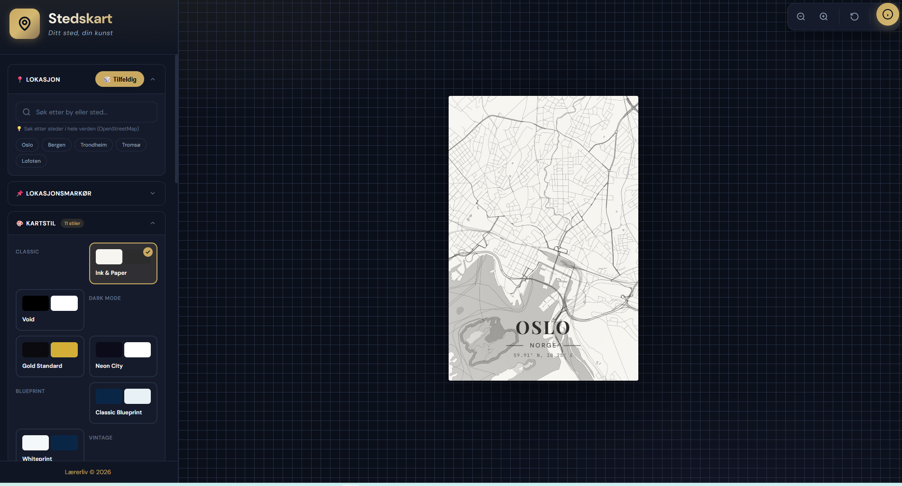
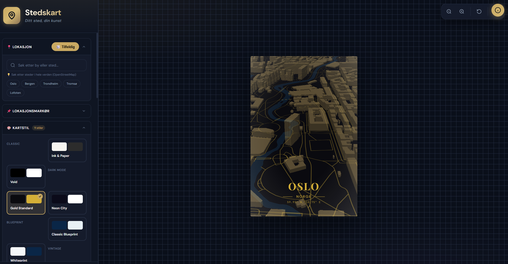
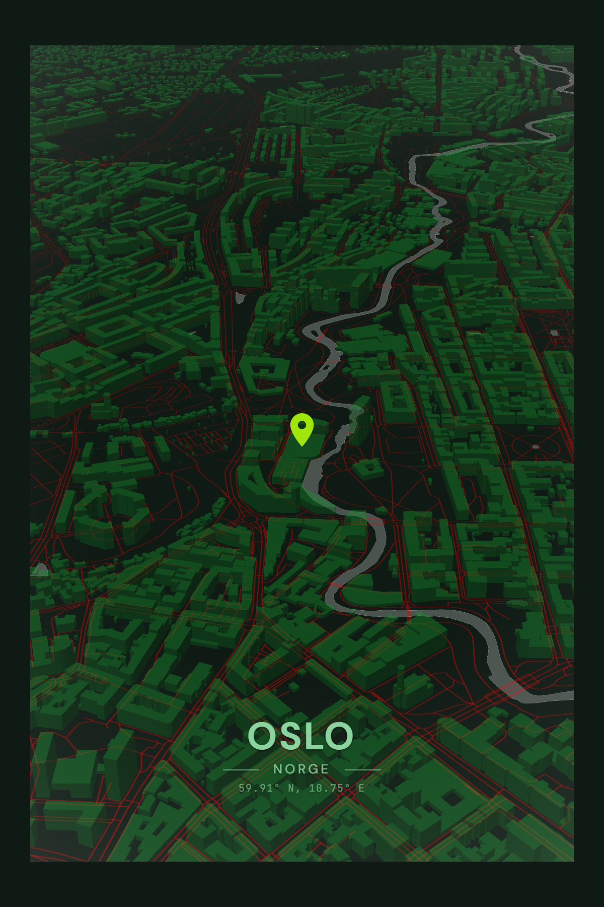

# 📍 Stedskart — Ditt sted, din kunst

**Stedskart** er en nettbasert applikasjon for å lage vakre, personlige kartplakater av dine favorittplasser. Perfekt som gave, minne fra en spesiell reise, eller som unik veggdekorasjon.

[](https://barx10.github.io/ART-location/)
[](#)

---

## 📸 Screenshots

<div align="center">

### 🎨 Design-grensesnitt

*Intuitiv sidebar med 6 kartstiler, 22 fonter og avanserte tilpasninger*

### 🌍 Kart & Kamera

*Kamerautsnitt med zoom, tilt og 360° rotasjon*

### 🖼️ Ferdig Plakat

*Høyoppløselig eksport med custom tekst, stickers og rammer*

</div>

---

## ✨ Funksjoner

### 🗺️ Kartfunksjoner
- **Global lokasjonssøk** via OpenStreetMap (Nominatim)
- **6 kartstiler** med 12 fargepaletter:
  - Classic (Ink & Paper, Void)
  - Dark Mode (Gold Standard, Neon City)
  - Blueprint (Classic, Whiteprint)
  - Vintage (Parchment, Sepia)
  - Retro (80s Synthwave, 90s Teal)
  - Nature (Ocean Abyss, Rainforest)
- **Kamerakontroll**: Zoom (8-16), Tilt (0-60°), Rotasjon (0-360°)
- **Tilfeldig lokasjonsgenerator**

### 🎨 Design & Tilpasning
- **22 Google Fonts** (DM Sans, Playfair Display, Bebas Neue, osv.)
- **Tekststørrelse & posisjon** (horisontal/vertikal kontroll)
- **Bokstavmellomrom** (letter spacing slider)
- **5 tekst-temaer**: None, Gradient, Box, Panel, Double
- **6 rammestiler**: None, Thin, Thick, Double, Vintage, Ornate
- **Fargetilpasning**:
  - Standard: Bakgrunn + tekst
  - Avansert: Individuelle farger for vann, parker, veier, bygninger
- **Emoji-stickers** med drag-and-drop
- **Kartjusteringer**: Saturasjon, kontrast, lysstyrke, vignette

### 📌 Lokasjonsmarkør
- **6 markørstiler**: Pin, Mål, Prikk, Ring, Hjerte, Hjem
- **Tilpassbar farge og størrelse**

### 💾 Eksport & Deling
- **Filformater**: PNG (tapsfri) eller JPEG (mindre filstørrelse)
- **Poster-formater**: Portrett (2:3), Landskap (3:2), Kvadrat (1:1)
- **Oppløsninger**:
  - Standard (2x): ~2400×3600px
  - Høy (4x): ~3500px høyde
  - Print (6x): ~5500px høyde
- **Fullstendig klient-side** — ingen API-nøkkel nødvendig
- **Del til utklippstavle** eller native deling

---

## 🛠️ Teknologi

### Frontend
- **Vanilla JavaScript** (ES6+)
- **MapLibre GL JS** v4.7.1 (åpen kildekode kartbibliotek)
- **HTML5 Canvas API** for poster-komposisjon
- **html2canvas** for klient-side eksport
- **CSS3** med CSS Custom Properties

### Kartdata
- **OpenStreetMap** via OpenFreemap vector tiles
- **Nominatim** for global geokoding

### Arkitektur
Modulær struktur med separerte concerns:
```
js/
├── constants.js    # Kartstiler, fonter, lokasjoner
├── state.js        # Global state management
├── map.js          # MapLibre initialisering og style
├── ui.js           # Event listeners og UI-oppdateringer
├── poster.js       # Poster rendering og temaer
├── stickers.js     # Sticker plassering og drag-and-drop
├── export.js       # Canvas-eksport og bildebehandling
└── utils.js        # Hjelpefunksjoner
```

---

## 🚀 Kom i gang

### Lokal kjøring
```bash
# Klon repositoryet
git clone https://github.com/barx10/ART-location.git
cd ART-location

# Åpne index.html i nettleser
open index.html
# eller
python -m http.server 8000
# Naviger til http://localhost:8000
```

**Merk**: Appen fungerer helt uten API-nøkler — all rendering skjer i nettleseren.

---

## 📖 Brukerveiledning

### 1. Velg lokasjon
- Søk etter by/sted i søkefeltet (global søk)
- Eller bruk hurtigknappene (Oslo, Bergen, Trondheim, osv.)
- Eller klikk "🎲 Tilfeldig" for random lokasjon

### 2. Tilpass design
- Velg kartstil fra 6 kategorier med 12 fargepaletter
- Juster zoom, tilt og rotasjon
- Velg font, farger og ramme
- Legg til tekst (tittel, undertittel, koordinater, dato)
- Legg til lokasjonsmarkør med valgt stil og farge
- Plasser emoji-stickers på kartet

### 3. Avanserte innstillinger
- **Avanserte farger**: Tilpass vann, parker, veier, bygninger individuelt
- **Kartjusteringer**: Finjuster saturasjon, kontrast, lysstyrke

### 4. Eksporter
- Velg filformat (PNG eller JPEG)
- Velg oppløsning (Standard, Høy, Print)
- Klikk "Last ned plakat"

---

## ⌨️ Hurtigtaster

| Tast | Funksjon |
|------|----------|
| `+` / `-` | Zoom inn/ut |
| `R` | Tilbakestill kart |
| `E` | Eksporter plakat |
| `C` | Kopier til utklippstavle |
| `I` | Åpne info-modal |
| `Esc` | Lukk dialog |
| `Cmd/Ctrl+S` | Eksporter |

---

## 🎯 Hva er nytt?

### v2.1 (Februar 2026)
- ✅ **Fullstendig klient-side** — ingen ekstern API nødvendig
- ✅ **6 kuraterte kartstiler** med 12 distinkte fargepaletter
- ✅ **Lokasjonsmarkører** — 6 stiler (Pin, Mål, Prikk, Ring, Hjerte, Hjem)
- ✅ **Forbedret høyoppløselig eksport** med korrekt zoom og viewport
- ✅ **Tema-fargevelger** for gradienter og bokser
- ✅ **Klassisk målestokk-bar** med ny stil

### v2.0 (Januar 2026)
- ✅ **JPEG-eksport** for mindre filstørrelse
- ✅ **Landskapsorientering** (3:2) i tillegg til portrett og kvadrat
- ✅ **Letter spacing kontroll** (bokstavmellomrom)
- ✅ **Avansert fargetilpasning** for kartelementer
- ✅ **Live forhåndsvisning** av alle innstillinger

### v1.0 (2025)
- 🗺️ Grunnleggende kartfunksjoner med MapLibre
- 🎨 Kartstiler og fargepaletter
- 🔤 22 fonter og teksttilpasning
- 📐 Kamerakontroll med zoom/tilt/rotasjon
- 🖼️ Ramme- og temasystem
- 💾 PNG-eksport i 3 kvaliteter

---

## 🙏 Takk til

### Åpen kildekode
- **[MapLibre GL JS](https://maplibre.org/)** — Åpen kildekode kartbibliotek
- **[OpenStreetMap](https://www.openstreetmap.org/)** — Kartdata fra bidragsytere verden over
- **[OpenFreemap](https://openfreemap.org/)** — Gratis vector tiles
- **[Nominatim](https://nominatim.org/)** — Gratis geokoding
- **[Google Fonts](https://fonts.google.com/)** — Gratis fonter
- **[html2canvas](https://html2canvas.hertzen.com/)** — Klient-side skjermbildefangst

---

## 📄 Lisens

MIT License © 2026 Kenneth Bareksten / [Lærerliv](https://www.laererliv.no/)

Kartdata © [OpenStreetMap](https://www.openstreetmap.org/copyright) bidragsytere

---

## 👤 Forfatter

**Kenneth Bareksten**
Lærer og hobbyprogrammerer som lager digitale verktøy for å gjøre hverdagen litt enklere og mer kreativ.

- 🌐 Website: [laererliv.no](https://www.laererliv.no/)
- 📧 Email: kenneth@laererliv.no
- 💼 GitHub: [@barx10](https://github.com/barx10)

---

## 🐛 Feilrapportering & Feature Requests

Fant du en bug eller har forslag til forbedringer? Opprett en [issue](https://github.com/barx10/ART-location/issues) på GitHub!

---

<div align="center">

**Laget med ❤️ i Norge**

[⬆ Tilbake til toppen](#-stedskart--ditt-sted-din-kunst)

</div>
